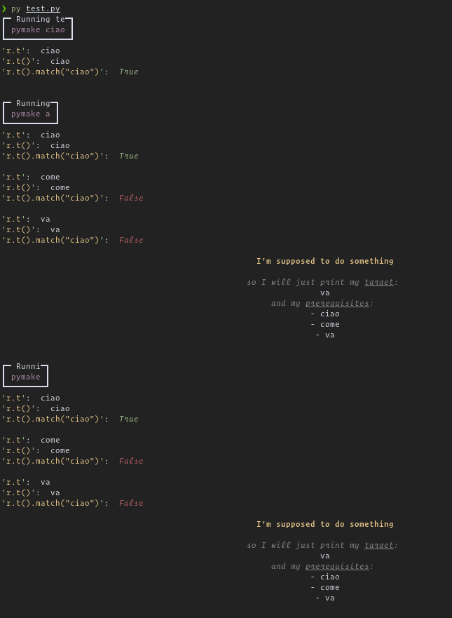

.. libmake.py documentation master file, created by
   sphinx-quickstart on Fri Oct 30 20:25:47 2020.
   You can adapt this file completely to your liking, but it should at least
   contain the root `toctree` directive.

.. image:: ../_assets/logo.png
   :width: 400
   :alt: logo

A python library for implementing ``makefile.py`` scripts.

.. toctree::
   :maxdepth: 2
   :caption: Content:
   :hidden:

   installation
   examples

.. toctree::
   :maxdepth: 2
   :caption: Code docstrings:
   :hidden:

   modules/libmake
   modules/lmcli

Generated with ``makefile.py`` you can find in :doc:`examples`.

Indices and tables
==================

* :ref:`genindex`
* :ref:`modindex`
* :ref:`search`
